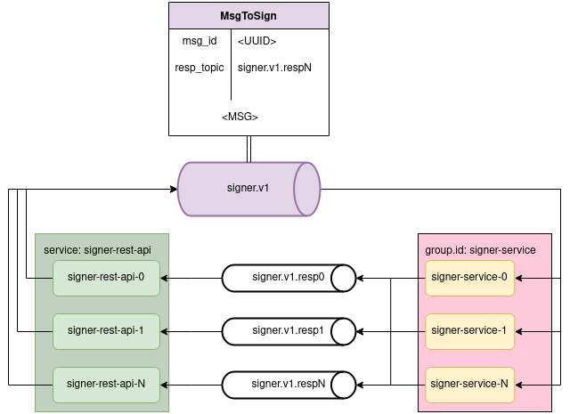

# Sign flow

[](https://github.com/xoac/signer-flow/actions)

Small project to build sign system with Rust and confluence platform

## Architecture



1. each `signer-rest-api` pod will send `MsgToSign` to single topic `signer.v1`
2. each `signer-rest-api` pod will have separate response topic `signer.v1.resp<N>` and each instance will be the only `group.id` member
3. each `signer-service` will be produce response to `resp_topic` topic that is know from request header
4. number of `signer-service` should be less or equal to `signer.v1` topic partitions to benefit from horizontal scaling

## Run with `minikube`

### Running

1. Run confluence platform for this example I used [quickstart-deploy example] as base.
    Here are commands that allowed me to run this on Linux machine. (This may require install additional software).

    Prepare (in `signer-flow` working dictionary)

    ```sh
    minikube start --driver=kvm2 --memory 6144 --cpus 6
    # here you need to wait a few secs
    kubectl create namespace confluent
    kubectl config set-context --current --namespace=confluent
    helm repo add confluentinc https://packages.confluent.io/helm
    helm upgrade --install operator confluentinc/confluent-for-kubernetes
    ```

2. Run confluent platform:
    ```sh
    kubectl apply -f k8s/confluent-platform-singlenode.yaml
    ```

3. Run signer flow:
    ```sh
    kubectl apply -f k8s/singer-flow.yaml
    ```

### Access to application

The value returned by below commands will probably be different in your case

1. Get current node ip:
    ```sh
    minikube ip
    ```
    In my case it was `192.168.39.211`

2. Find `singer-rest-api` port:
    ```sh
    kubectl get services signer-rest-api
    ```

    The port will be generated so output will be different. In my case the port is `32718`
    ```
    NAME              TYPE       CLUSTER-IP      EXTERNAL-IP   PORT(S)        AGE
    signer-rest-api   NodePort   10.105.210.60   <none>        80:32718/TCP   36m
    ```

3. Get access in browser: `http://192.168.39.211:32718/sign`  
    - to test input some text to sign and press submit button. The ape use base64 encoder to sign messages.
    - the output will returned with `ok: <signed_msg>` or `err: <err>` if error occurs

[quickstart-deploy example]: https://github.com/confluentinc/confluent-kubernetes-examples/tree/master/quickstart-deploy

### Monitoring

1. Monitor k8s local cluster `minikube dashboard --url`
2. Monitor confluent platform
    ```sh
    kubectl port-forward controlcenter-0 9021:9021
    ```
    now open control center website: `http://localhost:9021`

## Further improvements

Since this is example app and not fully production application here are summary of improvements that could be added.

1. The biggest demo problem is with `./k8s/singer-flow.yaml` and running `singer-rest-api` instances. There are 2 possible improvements to current boilerplate solution:
    1. Use `helm` and template engine to generate instances in loop
    2. Each `signer-rest-api` instance could create unique topic with prefix `signer.v1.resp` at startup (I would choose this as improved)
2. Add system testing
3. `Dockerfile`s file are nearly the same and could be unified
4. Rust:
    0. Application run with tokio task if such task panic other task can still run. Application can stop working correctly but still be running.
    1. apps use a lot of `expect()` and `unwrap()` also for external input
    2. Some code could be shared between `signer-service` and `signer-rest-api`
    3. Error handling could me much more improved (for example do not pass all KafkaError to end user)
5. Topic schemas could be added
6. browser js client could use json and distinguish error from correct responses
7. Add CD to publish new releases to docker hub


## License

Licensed under Boost Software License - Version 1.0 [BSL-1.0](LICENSE) or https://www.boost.org/LICENSE_1_0.txt

## Contribution

Unless you explicitly state otherwise, any contribution intentionally submitted
for inclusion in the work by you, as defined in the BSL-1.0 license, should not contains
any additional terms or conditions.

See [CONTRIBUTING.md](CONTRIBUTING.md).
